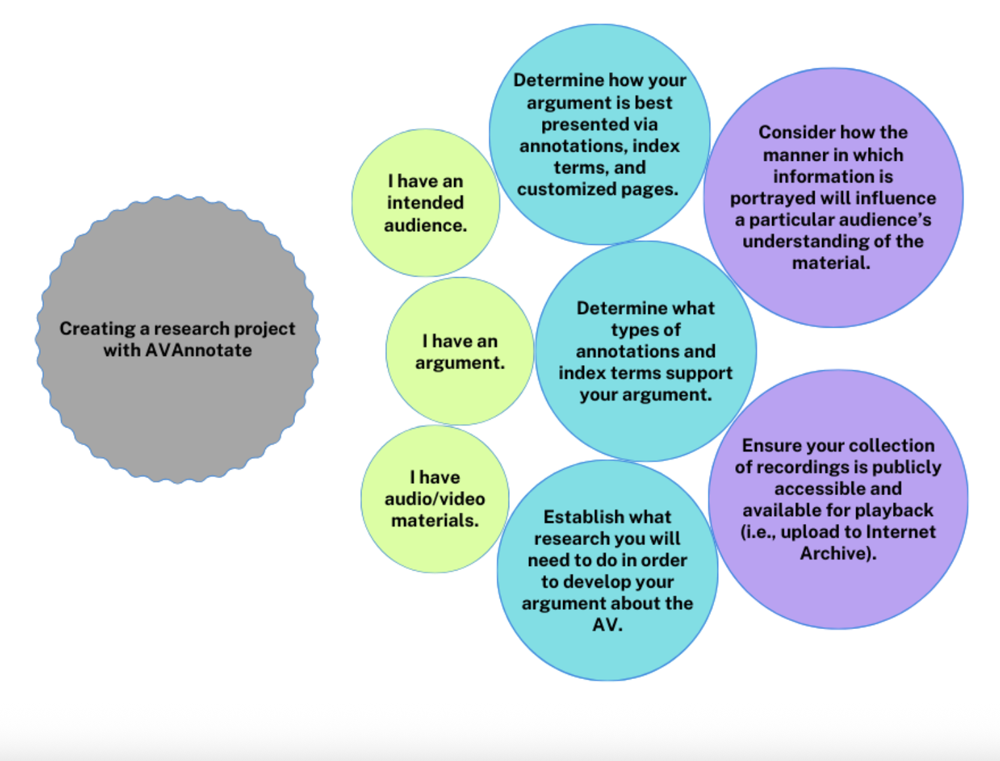

# Research Workflows
In each of the following intersecting workflows for creating an AVAnnotate project, there are two considerations to keep in mind: 
- How the information is portrayed will influence a particular audience’s understanding of the audiovisual material being made available in an AVAnnotate project.
- How and if recordings have been made accessible online for a public audience influences how the recordings can be made accessible for playback (i.e., upload to the Internet Archive) in an AVAnnotate project.

  
I have an intended audience

→ Determine how your argument is best presented to your audience via annotations, index terms, and customized pages  
→ Determine what types of annotations and index terms support how you present your argument to your audience  
→ Establish what research you will need to do in order to develop your argument about the AV and present it to your audience  

  
I have an argument

→ Determine what types of annotations and index terms support how you present your argument to your audience  
→ Establish what research you will need to do in order to develop your argument about the AV and present it to your audience  
→ Determine how your argument is best presented to your audience via annotations, index terms, and customized pages  

  
I have audiovisual materials

→ Establish what research you will need to do in order to develop your argument about the AV and present it to your audience  
→ Determine how your argument is best presented to your audience via annotations, index terms, and customized pages  
→ Determine what types of annotations and index terms support how you present your argument to your audience

