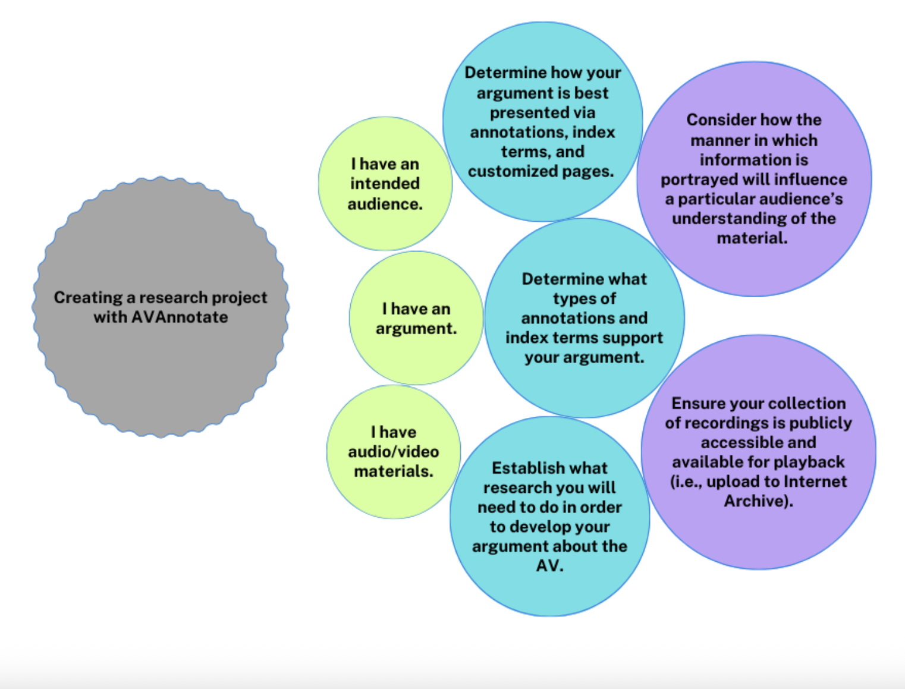

# Researchers
Researchers seeking to use AV materials for professional/non-academic publications such as newspaper articles, films, books, websites should also consider ethical representation of the original material, any legal and copyright restrictions given by the material source, and the use of AVAnnotate in a responsible manner as per traditional research ethical standards. 

## Research workflows
In each of the following intersecting workflows for creating an AVAnnotate project, there are two considerations to keep in mind: 
- How the information is portrayed will influence a particular audience’s understanding of the audiovisual material being made available in an AVAnnotate project.
- How and if recordings have been made accessible online for a public audience influences how the recordings can be made accessible for playback (i.e., upload to the Internet Archive) in an AVAnnotate project.

  
I have an intended audience

→ Determine how your argument is best presented to your audience via annotations, index terms, and customized pages  
→ Determine what types of annotations and index terms support how you present your argument to your audience  
→ Establish what research you will need to do in order to develop your argument about the AV and present it to your audience  

  
I have an argument

→ Determine what types of annotations and index terms support how you present your argument to your audience  
→ Establish what research you will need to do in order to develop your argument about the AV and present it to your audience  
→ Determine how your argument is best presented to your audience via annotations, index terms, and customized pages  

  
I have audiovisual materials

→ Establish what research you will need to do in order to develop your argument about the AV and present it to your audience  
→ Determine how your argument is best presented to your audience via annotations, index terms, and customized pages  
→ Determine what types of annotations and index terms support how you present your argument to your audience

## Additional Resources   
- [How to Start a Project on AVAnnotate - Documentation](https://docs.google.com/document/d/1Rou29JsV8e2hmj2MLf8gPolYCZgX43jc_vRObgp6OoI/edit?usp=drive_link)
  This guide walks through starting a project, drawing on one scholar’s experience creating a project with AVAnnotate:
- [Flint Project Planning Narrative](https://docs.google.com/document/d/1Yf2UIh9vmOlZzWWeF-Op1C0LrsvNQKKdqJg5un3_86Y/edit?usp=sharing)
  This document outlines some of the planning and research processes for this AVAnnotate project about [Leslie Flint’s mediumship](https://saamturner.github.io/flint/pages/sound-as-rhetorical-assemblage/).
- [ES_AVA_ Rationale for Annotation Sets and Tag Categories](https://docs.google.com/document/d/1Td7wy92NWehVCyT2-zAiKiS7Nz1sDEhH/edit?usp=drive_link&ouid=112492510360958259862&rtpof=true&sd=true)
  This document describes the rationale behind developing annotation sets, tag categories, and tags for the [Enough Said-AVAnnotate Community Annotation Project](https://spokenweb.github.io/enough-said-reading-series/). 

