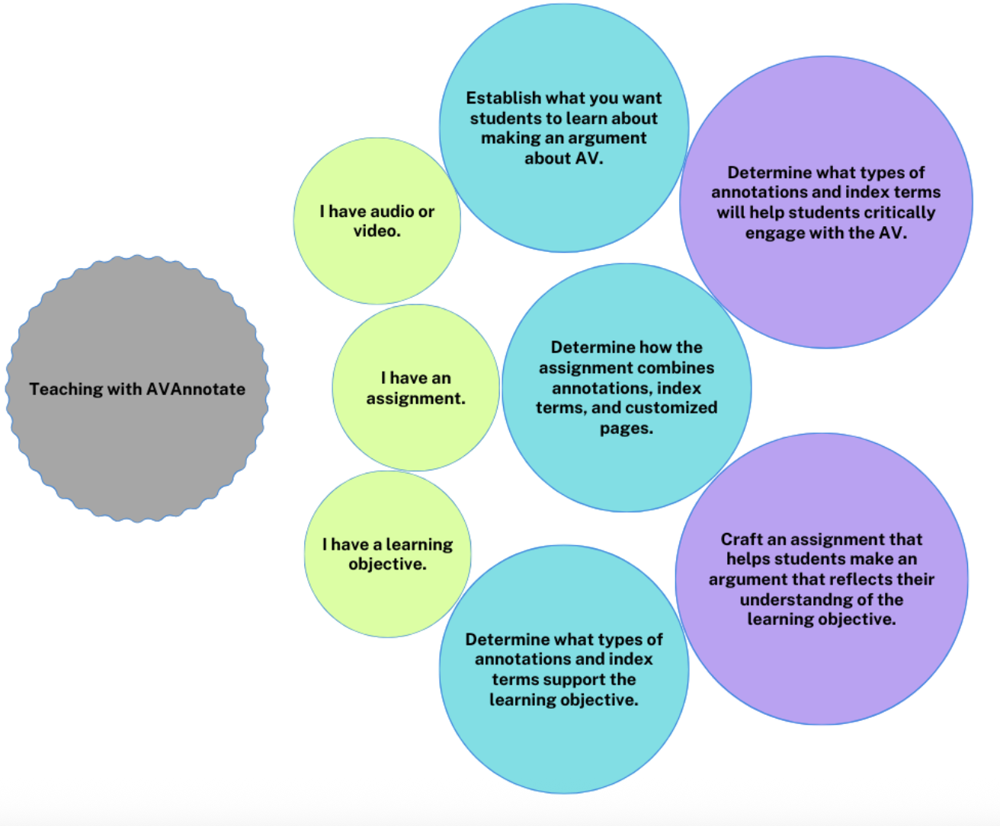

---
title: Teaching Workflows
layout: home
grandparent: User Guidelines
parent: Educators
nav_order: 2
---
# Teaching workflows

In each of the following intersecting workflows for creating an AVAnnotate project, there are two considerations to keep in mind: 
- How the annotations and index terms employed in the AVAnnotate project will help students critically engage with the AV.
- How the assignment is crafted to help students make an argument with AVAnnotate that reflects their understanding of the learning objectives.

  
I have audiovisual materials

→ Establish what you want students to learn about making an argument about AV  
→ Determine how the assignment combines annotations, index terms, and customized pages  
→ Determine what types of annotations and index terms support the learning objective  
  

  
I have an assignment

→ Determine how the assignment combines annotations, index terms, and customized pages  
→ Determine what types of annotations and index terms support the learning objective  
→ Establish what you want students to learn about making an argument about AV  
  

  
I have a learning objective

→ Determine what types of annotations and index terms support the learning objective  
→ Establish what you want students to learn about making an argument about AV  
→ Determine how the assignment combines annotations, index terms, and customized pages
  

  
  
